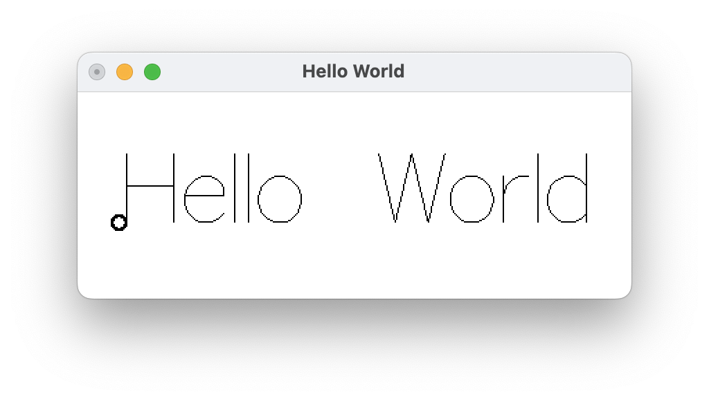
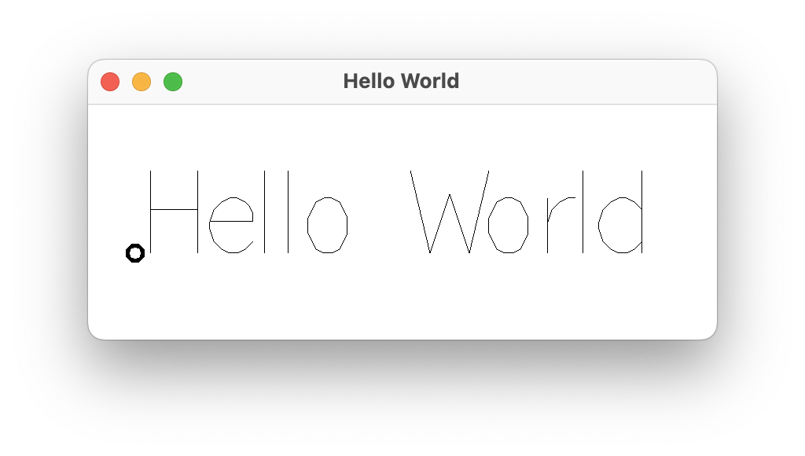

# Changelog

## 2024-11-26 - 1.13.3

- Remove support for deprecated backends GLUT and SDL and use GLFW instead
  - High DPI / Retina display support
  - (x) button can be used to close the window
  - Re-implement support for vector font and improve several character glyphs:
      <table>
        <tr style="text-align: center"><td>Old</td><td>New</td><tr>
        <tr>
          <td></td>
          <td></td>
        </tr>
      </table>
- Remove broken `gloss-raster` due to unmaintained dependency "repa"
- In-source `brillo-juicy` package
- Remove broken Travis CI scripts
- Add screenshots to all examples
- Manage issues and discussions on GitHub
- Format all code with [Fourmolu](https://github.com/fourmolu/fourmolu)
    and [cabal-fmt](https://github.com/phadej/cabal-fmt)

## 2018-10-07 - 1.13.1

Thanks to Thaler Jonathan
- Repaired GLFW backend.

Thanks to Samuel Gfrörer
- Support for bitmap sections.

Thanks to Basile Henry
- Handle resize events in playField driver.

## 2018-03-17 - 1.12.1

Thanks to Trevor McDonell
- Travis CI integration, general cleanups.

## 2017-03-14 - 1.11.1

Thanks to Lars Wyssard
- Use default display resolution in full-screen mode.

## 2016-04-06 - 1.10.1

- Gloss no longer consumes CPU time when displaying static pictures.
- Added displayIO wrapper for mostly static pictures, eg when
  plotting graphs generated from infrequently updated files.
- Allow viewport to be scaled with control-left-click drag.
- Rotation of viewport changed to alt-left-click drag.
- Preserve current colour when rendering bitmpaps.
- Changed to proper sum-of-squares colour mixing, rather than naive
  addition of components which was causing mixed colours to be too dark.

Thanks to Thomas DuBuisson
- Allow bitmaps to be specified in RGBA byte order as well as ABGR.

Thanks to Gabriel Gonzalez
- Package definitions for building with Stack.

## 2014-11-29 - 1.9.1

Thanks to Elise Huard
- Split rendering code into gloss-rendering package.

## 2014-05-04 - 1.8

Thanks to Francesco Mazzoli
- Factored out ViewPort and ViewState handling into user visible modules.

## 2012-01-06 - 1.7

- Tweaked circle level-of-detail reduction code.
- Increased frame rate cap to 100hz.

Thanks to Doug Burke
- Primitives for drawing arcs and sectors.

Thanks to Thomas DuBuisson
- IO versions of animate, simplate and play.

## 1.6

Thanks to Anthony Cowley
- Full screen mode display mode.

## 2011-10-29 - 1.5

- O(1) Conversion of ForeignPtrs to bitmaps.
- An extra flag on the Bitmap constructor allows bitmaps to be cached
  in texture memory between frames.

## 2011-10-24 - 1.4

- Added texture caching.

Thanks to Christiaan Baaij:
- Refactoring of Gloss internals to support multiple window manager backends.
- Support for using GLFW as the window library instead of GLUT.
    GLUT is still the default, but to use GLFW install gloss with:
      cabal install gloss --flags=\"GLFW -GLUT\"

## 2011-04-05 - 1.3

- Various wibbles for GHC 7.1

Thanks to Ben Lambert-Smith:
- New support for displaying bitmap files.

## 1.2

- Cleaned up module hierarchy.
- Added line-line intersection utils.
- Enabled -Wall and fixed all warnings.
- Various wibbles for GHC 7.0

Thanks to Thomas DuBuisson:
- Fixed a bug causing motion events to give the wrong position.

Thanks to Stephan Maka:
- Fixed a space leak in simulate mode when the window was hidden.

## 2010-09-13 - 1.1

- Added game mode.
- Added QuadTree and Extent structures.
- Added simple ray casting.
