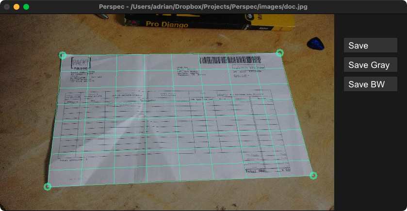

# Brillo

Brillo hides the pain of drawing simple vector graphics and raster images
behind a nice data type and a few display functions.

<table>
  <tr>
    <td>
      
    </td>
    <td>
      
    </td>
    <td>
      
    </td>
  </tr>
</table>


## Example

Getting something on the screen is as easy as:

```hs
import Brillo

main = display
  (InWindow "Nice Window" (200, 200) (10, 10))
  white
  (Circle 80)
```

Explore and run the [example projects](./brillo-examples/README.md)
with [stack](http://haskellstack.org):

```sh
stack run brillo-boids
```


## Usage

Once the window is open you can use the following:

- Quit
  - esc-key
- Move Viewport
  - arrow keys
  - left-click drag
- Zoom Viewport
  - page up/down-keys
  - control-left-click drag
  - right-click drag
  - mouse wheel
- Rotate Viewport
  - home/end-keys
  - alt-left-click drag
- Reset Viewport
  - 'r'-key


## More

- Animations and simulations can be constructed similarly
    using the `animate` and `simulate` functions
- Games with user input can be constructed with the `play` function.
- See the [brillo-examples](./brillo-examples/README.md) directory for more.


## Installation

Install necessary native dependencies like this:

### Fedora

```sh
sudo dnf install glfw-devel libXxf86vm-devel
```

### Arch

```sh
sudo pacman -S glfw libxxf86vm
```


## Contributing

Contributions are very welcome!

Please test that all the `brillo-examples` still work
before submitting your pull request.


## History

This library is a fork of [gloss](https://github.com/benl23x5/gloss)
and improves upon it in several ways.
Check out the [CHANGELOG](./CHANGELOG.md) for more details.
