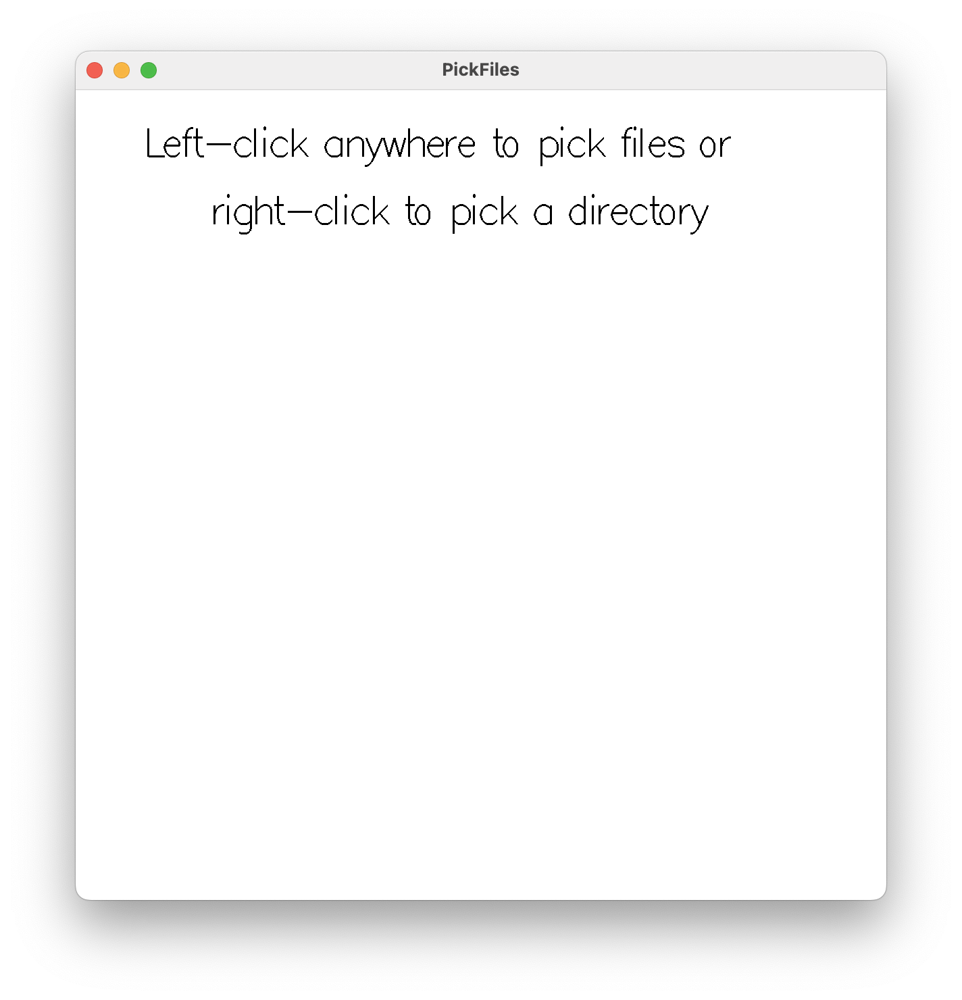

# Brillo Examples

Execute the commands in the root directory of the repository.

## Tech Demos

Command | Result
--------|--------
`stack run brillo-bitmap`     | 
`stack run brillo-boids`      | 
`stack run brillo-clock`      | 
`stack run brillo-color`      | 
`stack run brillo-conway`     | 
`stack run brillo-draw`       | 
`stack run brillo-dropfiles`  | 
`stack run brillo-easy`       | 
`stack run brillo-eden`       | 
`stack run brillo-export`     | 
`stack run brillo-flake`      | 
`stack run brillo-gameevent`  | 
`stack run brillo-graph`      | 
`stack run brillo-gravity`    | 
`stack run brillo-hello`      | 
`stack run brillo-lifespan`   | 
`stack run brillo-machina`    | 
`stack run brillo-occlusion`  | 
`stack run brillo-pickfiles`  | 
`stack run brillo-polygons`   | 
`stack run brillo-render`     | 
`stack run brillo-styrene`    | 
`stack run brillo-tree`       | 
`stack run brillo-visibility` | 
`stack run brillo-zen`        | 

## Games

Command | Result
--------|--------
`stack run brillo-2048`       | 
`stack run brillo-chess`      | 
`stack run brillo-tetris`     | 
