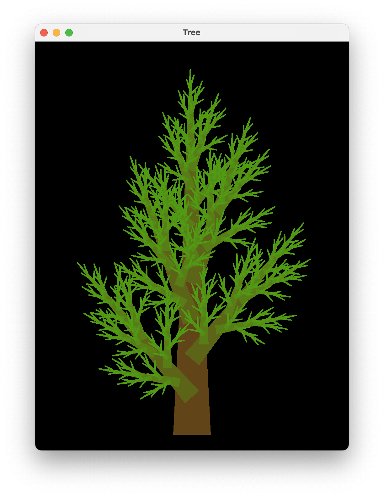

# Gloss Examples

Execute the commands in the root directory of the repository.

Command | Result
--------|--------
`stack run gloss-bitmap`     | 
`stack run gloss-boids`      | 
`stack run gloss-clock`      | 
`stack run gloss-color`      | 
`stack run gloss-conway`     | 
`stack run gloss-draw`       | 
`stack run gloss-easy`       | 
`stack run gloss-eden`       | 
`stack run gloss-flake`      | 
`stack run gloss-gameevent`  | 
`stack run gloss-graph`      | 
`stack run gloss-gravity`    | 
`stack run gloss-hello`      | 
`stack run gloss-lifespan`   | 
`stack run gloss-machina`    | 
`stack run gloss-occlusion`  | 
`stack run gloss-render`     | 
`stack run gloss-styrene`    | 
`stack run gloss-tree`       | 
`stack run gloss-visibility` | 
`stack run gloss-zen`        | 
